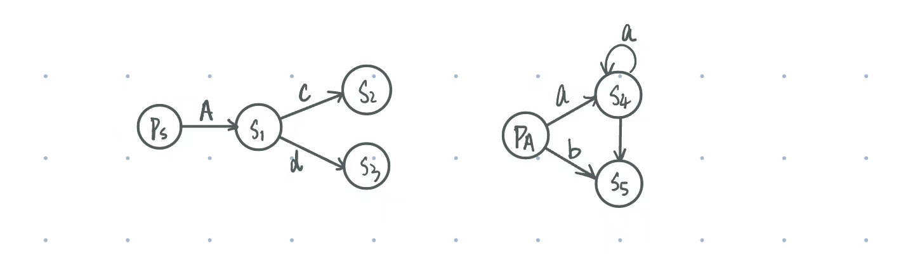

## Lexer-Q1 理解构建步骤

由词法描述文件构建词法分析器并运行该分析器的步骤如下：

* **设置环境变量**：设置 `LD_LIBRARY_PATH`和 `CLASSPATH`环境变量，以确保 ANTLR 及其依赖库可以被正确找到。
* **定义 ANTLR 工具和测试工具的命令**：定义 `antlr4`和 `grun` 变量，分别用于调用 ANTLR 工具和测试工具。
* **检查参数**：检查传入的参数数量是否为 1。如果不是，则输出使用说明。
* **准备构建目录**：先删除`build`目录防止原本就有而无法创建，然后创建 `build`目录，用于存放生成的文件。
* **根据参数选择生成和运行词法分析器的步骤**：
  - 如果参数为 `java`，执行以下步骤：
    1. 切换到 `grammar`目录。
    2. 使用 ANTLR 工具生成 Java 版本的词法分析器代码，并将生成的文件输出到 `../build` 目录。
    3. 切换到 `build` 目录。
    4. 使用 `javac`编译所有生成的 Java 文件。
    5. 使用 `grun` 工具运行词法分析器，并输出词法单元。
  - 如果参数为 `cpp`，执行以下步骤：
    1. 切换到 `grammar`目录。
    2. 使用 ANTLR 工具生成 C++ 版本的词法分析器代码，并将生成的文件输出到 `../build` 目录。这里使用了 `-Dlanguage=Cpp` 参数来指定生成 C++ 代码。
    3. 切换到 `build`目录。
    4. 使用 `g++` 编译生成的 C++ 文件和测试文件 `lexer.cpp`，并将生成的可执行文件命名为 `c1lexer`。如果是在本地机器上运行还需要先设置 ANTLR 运行时库复制到 `/usr/local/lib/` 目录再链接，然后再使用`g++`编译。
    5. 运行生成的 `c1lexer` 可执行文件。

ANTLR  缺省时生成的分析器源码是用`java`编写的，需要指定使用`c++`编写时需要添加`-Dlanguage=Cpp`选项。

## Lexer-Q2 理解生成的分析器源码

**cpp：**

1. 词法单元的标识符的枚举：每个标识符对应于一种特定的词法单元类型，包括Comma(逗号)，SemiColon(分号)，Assign(赋值符号)等33种标识符。
2. **`decisionToDFA`**：词法分析器的决策状态机（DFA）。每个 DFA 对象用于处理特定的词法分析决策。
3. **`sharedContextCache`**：共享的预测上下文缓存，用于优化 ATN（抽象语法树）模拟过程中的上下文预测。
4. **`ruleNames`**：词法分析器的所有规则名称。
5. **`channelNames`**：词法分析器的所有通道名称。
6. **`modeNames`**：词法分析器的所有模式名称。
7. **`literalNames`**：词法分析器的所有字面量名称。
8. **`symbolicNames`**：词法分析器的所有符号名称。
9. **`vocabulary`**：词汇表对象，包含了词法分析器的字面量名称和符号名称，用于词法分析过程中标识和处理不同类型的词法单元。
10. **`serializedATN`**：序列化的 ATN（抽象语法树），用于词法分析器的初始化和解析。
11. **`atn`**：指向 ATN 对象的智能指针，用于词法分析器的解析和决策。

除词法单元标识符的枚举外，其余数据成员都包含在`C1LexerStaticData`结构体中。

**java:**

1. **`_decisionToDFA`**：每个决策的 DFA（确定性有限自动机），用于加速词法分析过程
2. **`_sharedContextCache`**：共享的预测上下文缓存，缓存了预测上下文，以便在多次使用相同上下文时可以重用。
3. 词法单元表示符：用各种常量表示词法单元的标识符，每个标识符对应于一种特定的词法单元类型。包括Comma(逗号)=1，SemiColon(分号)=2，Assign(赋值符号)=3等33种标识符。
4. **`channelNames`**：词法单元的通道名称，分为默认通道和隐藏通道。
5. **`modeNames`**：词法分析器的模式名称。模式用于定义词法分析器的不同状态，每个状态可以有不同的词法规则。
6. **`ruleNames`**：词法规则的名称。每个词法规则对应一个名称，用于标识该规则。
7. `_LITERAL_NAMES`：存储词法分析器中所有符号的字面量名称的私有静态常量数组。
8. `_SYMBOLIC_NAMES`：词法分析器中所有符号的名称的私有静态常量数组。
9. **`VOCABULARY`**：词法单元的字面量名称和符号名称。`Vocabulary`对象提供了从词法单元索引到其字面量名称和符号名称的映射。
10. **`tokenNames`**：存储词法单元的名称。
11. **`_serializedATN`**：序列化的 ATN 表示，用于初始化 `_ATN`。这是 ATN 的字符串表示形式，用于反序列化生成 ATN 对象。
12. **`_ATN`**：存储词法分析器的 ATN（抽象语法树），用于词法分析过程。ATN 是词法分析器的核心结构，定义了所有的词法规则和状态转换。

## Lexer-Q3 理解执行流程

**(1) main函数在哪定义**

`main` 函数通常定义在一个单独的文件中，例如 `main.cpp`。这个文件包含了词法分析器的入口点，负责初始化词法分析器并处理输入。

**(2) Lexer::nextToken()的处理过程：**

首先，通过调用 `_input->mark()`在字符流中标记当前的位置，并将其存储在 `tokenStartMarker`变量中。接着，使用 [`finally`](vscode-file://vscode-app/f:/Microsoft VS Code/resources/app/out/vs/code/electron-sandbox/workbench/workbench.html) 机制确保在方法结束时，无论是否发生异常，都会调用 `_input->release(tokenStartMarker)` 释放标记。这是为了防止未缓冲的字符流持续缓冲数据。

然后，进入一个无限`while`循环，直到成功生成一个词法单元或遇到文件结束（EOF）。在循环的开始，检查 `hitEOF`标志，如果为真，则调用 `emitEOF()` 方法生成一个 EOF 词法单元，并返回该词法单元。

在每次循环迭代中，重置 `token`，将 `channel`设置为默认通道，并记录当前字符索引、行号和列号。然后，进入一个嵌套的 `do-while` 循环，循环的条件为`type == MORE`，尝试匹配输入流中的字符以生成词法单元。

在 `do-while` 循环中，首先将 `type` 设置为无效类型，并调用 `getInterpreter()->match(_input, mode)`尝试匹配字符。如果匹配过程中抛出 `LexerNoViableAltException`异常，则调用 `notifyListeners(e)`报告错误，并调用 `recover(e)`方法尝试恢复。匹配失败时，将 `ttype`设置为 `SKIP`。

然后检查输入流是否到达 EOF，如是则设置 `hitEOF`标志为`true`。如果不是，再检查 `type`是否仍为无效类型，如果是，则将其设置为 `ttype`。然后检查`type`是否 为 `SKIP`，如是则跳转到 `outerContinue` 标签即外层`while`循环的起始处，继续下一次循环迭代。

如果 `type` 为 `MORE`，则继续进行`do-while`循环匹配更多字符。否则，检查 `token`是否为空，如果为空，则调用 `emit()`方法生成一个新的词法单元。最后，返回生成的词法单元。

**(3) BufferedTokenStream::LA的处理过程：**

调用`LT(i)`对象的`getType()`方法来查看输入流中相对当前位置的第 `i`个词法单元的类型。，`Lexer`对象的`getType()`方法会返回对象的`type`成员变量的值，表示词法单元类型。

**(4) `C1Lexer`、`Lexer`、`CommonTokenStream`、`BufferedTokenStream`四者之间的关系**：

- `C1Lexer` 是具体的词法分析器，继承自 `Lexer` 类，实现了 `Lexer` 类的接口。
- `Lexer`类是词法分析器的抽象基类，定义了词法分析器的基本行为，如 `nextToken()` 方法。
- `BufferedTokenStream`提供了对词法单元流的缓冲和随机访问功能，是`CommonTokenStream` 的基类。
- `CommonTokenStream` 继承自 `BufferedTokenStream`，并提供了更高级的词法单元流管理功能。

## Parser-Q1 理解LL(*)分析方法[PLDI 2011] 的原理

* **简述`LL(*)`分析方法的核心逻辑，它与传统的`LL`分析区别在哪里？**

  LL(\*) 解析器的核心思想是通过使用正规式进行向前看，而不是依靠固定的向前看深度或者完全依靠解析器的回溯。其分析目标是为每个非终结符构建一个向前看的确定性有限自动机 (DFA)，以区分产生式选择，从而做出预测决策。

  `LL(\*)`与传统的`LL`分析的区别主要在向前看符号的数量，决策过程和解析能力上：

  * **前瞻符号数量**：传统的 `LL(k)` 分析器使用固定数量的前瞻符号 `k` 来解析输入。如果 `k` 不足以消除歧义，解析器可能会失败。而`LL(*)` 分析器可以使用任意数量的前瞻符号，从而能够处理更复杂的语法结构和消除更多类型的歧义。
  * **决策过程**：传统的 `LL(k)` 分析器在每一步解析过程中只能基于固定数量的前瞻符号做出决策。而`LL(*)` 分析器使用决策树和动态前瞻符号数量来做出解析决策，从而具有更强的解析能力。
  * **解析能力**：由于 `LL(k)` 分析器的前瞻符号数量是固定的，它们在处理某些复杂语法时可能会遇到困难。而`LL(*)` 分析器通过使用任意数量的前瞻符号和决策树，能够处理更复杂的语法结构，具有更强的解析能力。

  

* **证明下面的文法为`LL-regular`文法，并按照文章的`LL(*) parser`构造算法绘制该文法的 ATN 和 Lookahead DFA。在算法执行过程中会出现哪些问题？解释问题产生的原因。假设 ATNLR 允许的最大递归深度m=1。** 

  **证明：**

  * 非左递归：该文法显然是非左递归的。

  * 无二义性：

    - 对于 `S → Ac | Ad`，输入的最后一个符号 `c` 或 `d` 明确区分了 `Ac` 和 `Ad`，因此没有二义性。

    - 对于 `A → aA | b`，可以通过输入的第一个符号来区分。如果输入是 `a`，则使用产生式 `A → aA`，如果输入是 `b`，则使用 `A → b`。

    因此，该文法是无二义的。

  * 正则划分：

    * 对 `S → Ac | Ad`，需要区分 `Ac` 和 `Ad`，可以通过单字符正则表达式 `{c, d}` 区分这两个候选产生式。这是一个正则集合，可以通过有限自动机 (DFA) 实现。

    * 对 `A → aA | b`，需要区分 `aA` 和 `b`，可以通过 `{a, b}` 正则集合唯一确定输入对应的候选产生式。

  * 构造 `LL(*) Lookahead DFA`：每个非终结符都可构造出DFA用于根据剩余输入预测适当的输出，构造见下。

  综上，该文法是`LL-regular`文法。

  **ATN与DFA：**

  首先定义ATN状态如下：

  |             输入文法的元素             |                      对应的ATN状态转换                       |
  | :------------------------------------: | :----------------------------------------------------------: |
  |        $A \rightarrow \alpha_i$        | $p_A \xrightarrow{\epsilon} p_{A,i} \xrightarrow{\epsilon} \boxed{\alpha_i}\xrightarrow{\epsilon} p_{A}'$ |
  |   $A \rightarrow \{\pi_i\}?\alpha_i$   | $p_A \xrightarrow{\epsilon} p_{A,i} \xrightarrow{\pi_i} \boxed{\alpha_i}\xrightarrow{\epsilon} p_{A}'$ |
  |       $A \rightarrow \{\mu_i\}$        | $p_A \xrightarrow{\epsilon} p_{A,i} \xrightarrow{\mu_i}  p_{A}'$ |
  |        $A \rightarrow \epsilon$        | $p_A \xrightarrow{\epsilon} p_{A,i} \xrightarrow{\epsilon}  p_{A}'$ |
  | $\boxed{\alpha_i} = X_1 X_2 \dots X_m$ | $p_0 \xrightarrow{X_1} p_1 \xrightarrow{X_2} p_2 \xrightarrow{\dots} p_{m-1} \xrightarrow{X_m} p_m$ |

  然后可以构造出ATN如下：

  

​	根据ATN可以构造出DFA如下：

​	

**会出现的问题及原因：**

1. **递归深度限制**。

   原因：在构造 Lookahead DFA 时，递归规则要求解析器跟踪调用栈的深度，以便处理嵌套结构。然而，当递归深度被限制为 1 时，解析器只能进行一次递归展开。这会导致解析器在遇到需要多次递归时（如输入为多个 `a` 的情况），无法进行正确的展开和匹配，从而导致解析失败。

2. **非确定性选择问题**。

   原因：LL(*) 解析器通过 Lookahead 计算多个可能的解析路径。当 `A` 递归展开后，解析器需要继续查看后续的输入符号来区分 `c` 和 `d`。然而，递归深度受限可能导致 Lookahead 深度不足，从而无法唯一确定是走 `Ac` 还是 `Ad` 分支。

3. **状态爆炸问题**。

   原因：ATN 是一种非确定性有限状态自动机（NFA），递归和选择会生成大量的状态和转换。在递归深度 m=1m = 1m=1 的情况下，递归被迫展开并限制到特定深度，导致更多状态的生成，特别是在遇到复杂文法结构时。每个状态和递归的组合都会导致大量的 ATN 状态，这些状态需要在 Lookahead DFA 中被转换为确定性状态。

4. **Lookahead 计算复杂度增加**。

   原因：由于 Lookahead 需要预测输入符号的后续结构，当文法中包含递归时，Lookahead 必须考虑所有可能的递归展开路径。如果递归深度为 1，Lookahead 的预测能力会受到限制，这会导致解析器在处理分支时需要进行更多的路径探索和计算。

## Parser-Q2 理解Adaptive LL(*)分析方法[OOPSLA 2014]的原理

1. **简述`ALL(*)`分析方法的核心逻辑，试比较它与`LL(*)`分析方法的区别。**

   ALL(\*) 预测机制的核心思想是在每个非终结符的决策点启动多个子解析器，每个子解析器对应一个产生式选择。这些子解析器以伪并行方式运行，探索所有可能的解析路径。当某条路径无法匹配剩余输入时，相应的子解析器会终止。子解析器同步推进输入，解析器能够在最小向前看深度唯一预测出产生式选择。如果多个子解析器汇合或到达输入文件末尾，预测器将报告歧义，并优先选择编号最低的子解析器关联的产生式继续解析。

2. **给定如下文法，描述输入`xba`的`ALL(*)`分析过程并给出最终构造的`lookahead DFA`。**

   **分析过程：**
   
   首先根据第一个字符 `x`，选择 `S → xB` 产生式。在选择 `S → xB` 之后，解析器需要解析 `B`。根据 `B → Aa`，解析器现在需要进一步处理 `A`。对于非终结符 `A`，有两个选择：`A → b` 或 `A → ε`。此时，解析器的输入是 `ba`。解析器检查第一个符号 `b`，匹配产生式 `A → b`，因此解析器选择 `A → b`。匹配 `b` 后，输入剩下的是 `a`，接着根据 `B → Aa`，解析器检查 `a`，与 `a` 完全匹配。因此，整个输入 `xba` 成功匹配 `S → xB → xAa → xbA → xba`。
   
   **最终构造的`lokkahead DFA`如下：**
   

## 遇到的问题

### part2

实验的主要问题为理解`c1recognizer/run_lexer.sh`生成词法分析器的过程和生成的词法分析器的组成。

生成的C++词法分析器包括`C1Lexer.cpp` ，`C1Lexer.h`，`C1Lexer.interp` ，`C1Lexer.tokens` ，`c1lexer`。

其中`C1Lexer.cpp`是C++ 词法分析器实现文件，`C1Lexer.h`是相应的头文件， `C1Lexer.interp`是由词法分析器解释文件，`C1Lexer.tokens`是词法标记文件，`c1lexer`是词法分析器的可执行文件。

生成的java词法分析器包括`C1Lexer.class`，`C1Lexer.interp`，`C1Lexer.java` ，`C1Lexer.tokens`。

其中`C1Lexer.java`是由 ANTLR 生成的 Java 词法分析器源码文件，`C1Lexer.class`是由 Java 编译器生成的词法分析器字节码文件， `C1Lexer.interp`是由 ANTLR 生成的词法分析器解释文件，`C1Lexer.tokens`这是由 ANTLR 生成的词法标记文件。

### part3

实验遇到的主要问题为语法分析器的构造与使用，与词法分析器基本一致，只是最终通过`grun C1 compilationUnit -tree `命令显示解析结果。

此外还有文法左递归的问题，参照第一关提供的C1语言文法的`EBNF`表示设计出的解析语法包含`compilationUnit: (compilationUnit)? (decl | funcdef);`，这是左递归的。我将这一句改为了`compilationUnit: (decl | funcdef)+;`，表示的意思相同（compilationUnit由至少一个(decl | funcdef)组成），但消除了左递归。其余语法的表示均直接参照C1语言文法的`EBNF`表示，未做修改。
