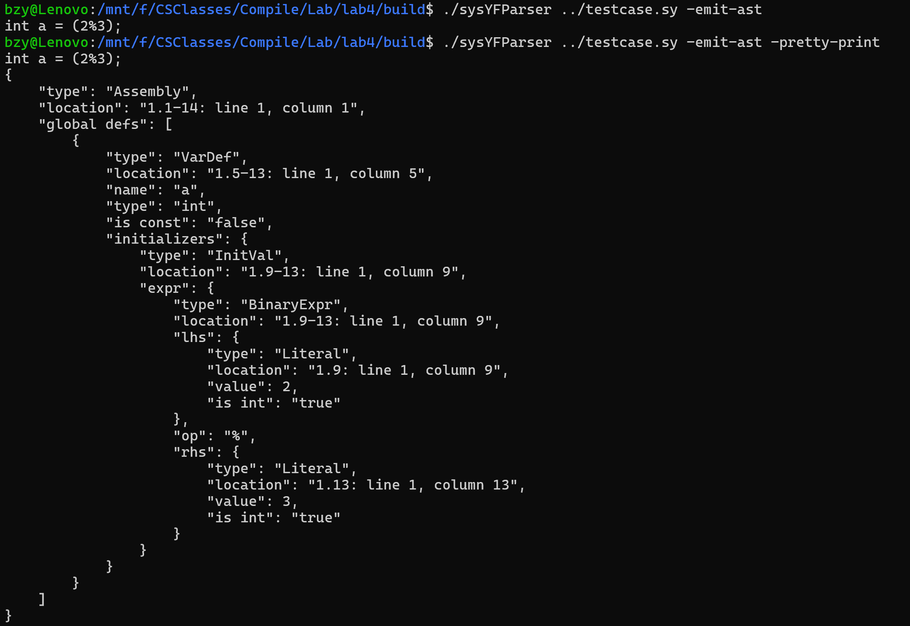

### 问题1-1

#### 节点类的结构

节点类的结构与SysYF的文法定义保持一致，基本上由节点的基本信息（如类型，名称等）和指向其他节点的指针或指针链表和一个 `accept` 方法组成组成。
#### `visit` 方法实现特点

节点`visit`方法用于打印节点内容，对于可以直接获得的信息如类型，名称等，会直接打印，而对于指针指向的其他节点，则会通过相应节点的`accept`方法来访问指向的节点（对于指针链表，会遍历其中的每一个指针应用`accept`方法）。

#### 总结

这些 `visit` 方法的实现特点主要包括：

- 打印节点的基本信息（如类型、名称）。
- 访问子节点（如表达式、参数、语句）。
- 处理数组和初始化等特殊情况。
- 处理缩进和格式化输出。
- 如果节点类的一个数据成员是指针或指针数组，就通过指针调用 `accept` 方法

### 问题1-2

编译运行SysYF解析器并处理testcase.sy程序输出语法树如下：


### 问题3-1

#### 遇到的问题与解决方案

1. 如何实现符号表的栈存储

   设计了`SymbolTable`这一数据结构（详见实现亮点部分）来存储一层作用域的符号表，用`std::vector<SymbolTable>`来存储所有的作用域。也就是相当于使用数组来实现了栈。

2. 如何处理作用域的嵌套

   维护一个全局变量`current_pos`来指向当前所处的作用域。当进入一层嵌套的作用域时，就将`current_pos`加1，退出时减1。具体来说就是在`visit(BlockStmt& node)`和`visit(SyntaxTree::FuncParam& node)`中进入时令`current_pos++`，退出时令`current_pos--`。

3. 结点属性的设置和结点子结构的访问之间的顺序问题

   刚开始我在函数内部对各种操作的顺序设置较为随意，在评测时出现了错误，后来发现结点的属性应该在最后设置，否则会影响对其子结构的递归访问。

#### 实验难点与考察倾向

实验难点：符号表的实现和嵌套作用域的处理以及访问者模式的应用。

考察倾向：对作用域和访问者模式的理解。

#### 整体实现思路与实现亮点

##### 思路

首先在程序一开始设置全局变量`symbol_tables`用来存储所有符号表和`current_pos`指向当前所处的作用域，初始化为0。在`visit(BlockStmt& node)`和`visit(SyntaxTree::FuncParam& node)`中进入时令`current_pos++`，退出时令`current_pos--`来实现作用域的嵌套处理。

在每个结点对应的`visit`方法的实现中，参考结点的结构体定义，对其中的指针或指针链表中的指针指向的子结构使用`accept`方法递归访问，`accept`方法会调用相应结点对应的`visit`方法。对于其中可以直接获得的属性，例如名称，类型，数值等直接在函数内部处理。

在处理变量定义和函数定义的`visit`方法中，首先需要检查当前作用域是否已有定义，如果有则报错并退出程序，如果没有，最后需要将定义的变量或函数添加到符号表中以供后续使用。

此外，因为函数的参数可能是数组类型，所以仿照`Expr_type`，我在`SyntaxTreeChecker`类添加了另一个成员变量`type`用来指示类型，这在调用函数进行参数匹配的检查时需要使用。

##### 亮点

设计了`SymbolTable`类来存储符号表，其数据成员是一个`map<string, NodeTypes>`，`NodeTypes`是一个结构体，包含结点的值类型和参数表的各个参数的数据类型（仅对函数调用有效，其他情况为空）。类中还实现了常用的三个方法，分别用于查找项，添加项和判断项是否存在。`NodeTypes`和`SymbolTable`定义如下：

```C++
struct NodeTypes {
    SyntaxTree::Type val_type;
    std::vector<SyntaxTree::Type> params_type; // empty for VarDef
};

class SymbolTable {
private:
    std::unordered_map<std::string, NodeTypes> symbol_table; // symbol table
public:
    SymbolTable() {};
    ~SymbolTable() {};

    NodeTypes lookup(std::string name) {
        if (symbol_table.find(name) == symbol_table.end()) {
            // not found
            return NodeTypes();
        }
        return symbol_table[name];
    }

    void add_type(std::string name, NodeTypes prop) {
        if (symbol_table.find(name) != symbol_table.end()) {
            // duplicated
            return;
        }
        symbol_table[name] = prop;
    }

    bool exist(std::string name) {
        return symbol_table.find(name) != symbol_table.end();
    }
};
```

这样定义的类可以很方便地实现对符号表的添加，查找和判断是否存在某一表项等操作，也可以很方便地存储和获得一个符号表项的数据类型和参数类型。

### 问题3-2

处理变量声明时应先将变量加入符号表，然后再处理变量的初始化。因为在初始化过程中，初始化表达式可能会引用到该变量。如果变量尚未加入符号表，初始化表达式中的引用将无法解析。

处理函数定义时应先将函数名加入符号表。这样可以确保在处理函数体之前，符号表中已经存在该函数的定义。这有助于在函数体中递归调用该函数时，能够正确地查找到函数的定义。

### 问题3-3

#### 给 `Expr` 添加一个属性用于判断是否为整数的缺点

1. **违反单一职责原则**：抽象语法树（AST）应该只表示程序的结构，而不应该包含语义信息。将类型信息添加到 AST 节点中，混淆了结构和语义的职责。这也是本次实验使用访问者模式所要避免的问题。
2. **增加 AST 的复杂性**：每个表达式节点都需要额外的属性来存储类型信息，增加了 AST 的复杂性和内存开销。
3. **维护困难**：如果类型信息需要更新（例如在类型推断过程中），需要确保所有相关节点的类型信息都被正确更新，增加了维护的难度。

#### 拆成多个类的缺点

1. **增加类的数量**：将 `SyntaxTreeChecker`拆分成多个类，会增加类的数量，可能导致代码库变得更加复杂。
2. **类之间的协调**：不同的语义检查类之间可能需要共享一些状态或信息，这需要额外的机制来协调这些类之间的交互，增加了实现的复杂性。并且对类的处理顺序也会成为一个问题。
3. **性能开销**：多个类之间的调用和状态共享可能会引入额外的性能开销，特别是在需要频繁进行语义检查的情况下。

### 问题3-4

首先需要定义各种错误的优先级。然后在`SyntaxTreeChecker.cpp`中遇到错误时先不报错退出，而是将错误存储在一个数组中，在检查完成后，遍历数组打印优先级最高的错误信息。也可以使用链表或队列来存储错误信息，当有新的错误发生时，根据优先级决定将这个错误信息插入到头部还是尾部，最后打印头部的错误信息即可。
