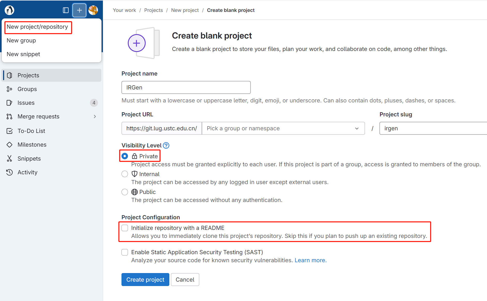
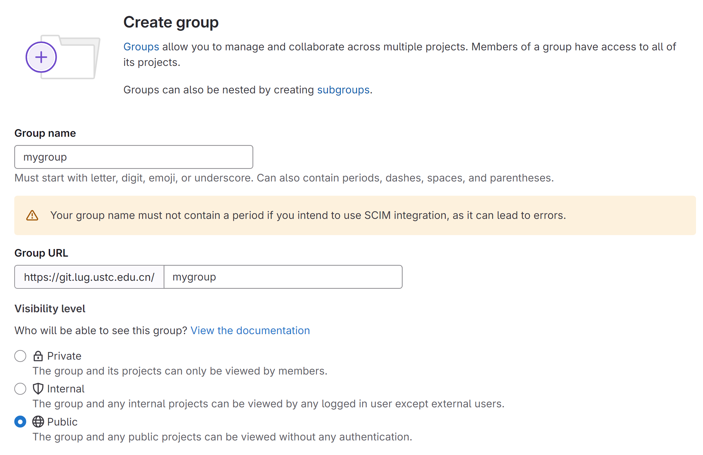
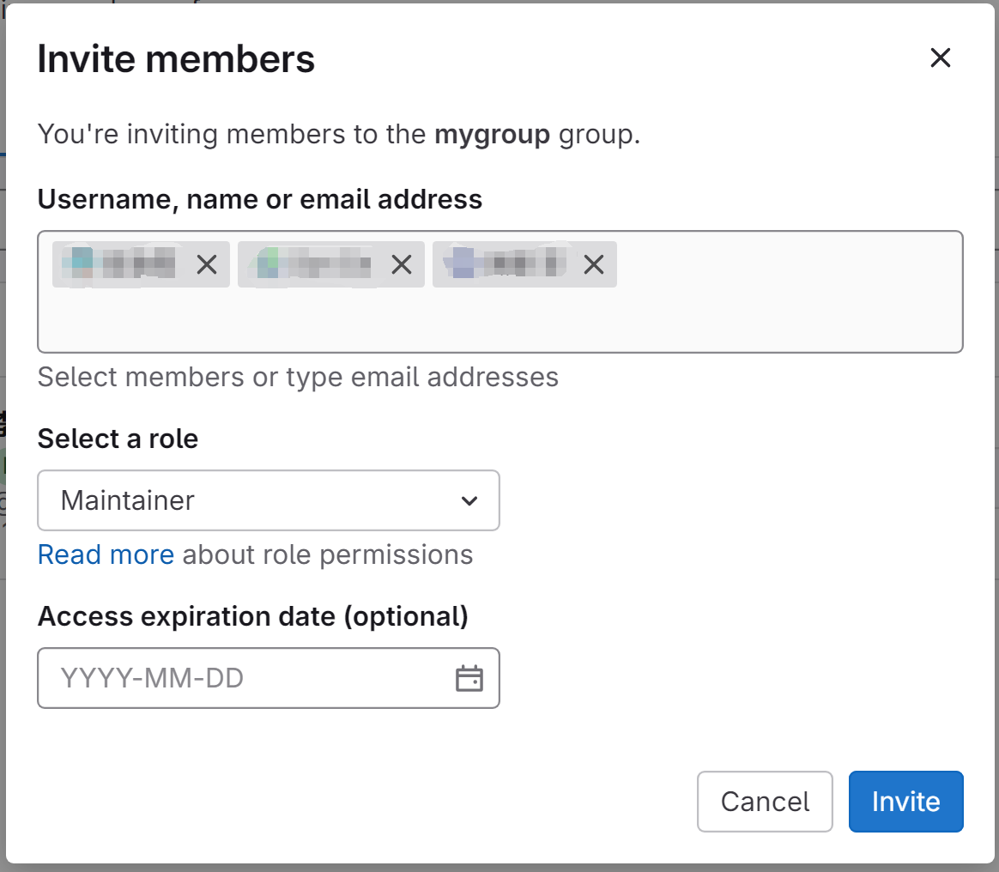
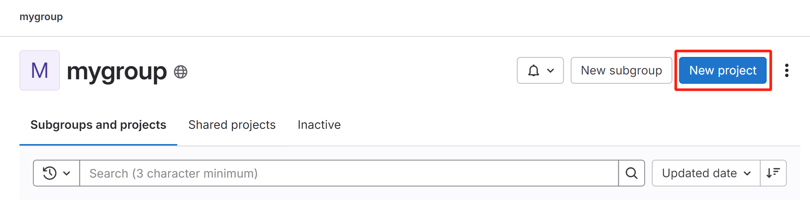
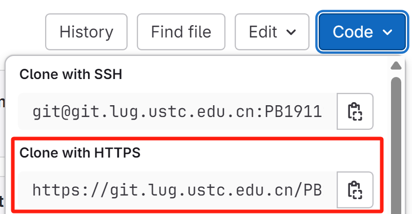

# 实验预备(本地)

本文档假定操作系统为ubuntu20.04以及以上的版本。

## Clang与LLVM

LLVM 是一个用 C++ 编写的开源编译基础设施项目，包括模块化编译器组件和工具链。它提供了一种称为 LLVM IR 的中间代码，介于高级语言和汇编语言之间。

Clang 是 LLVM 编译器工具集的前端，用于编译 C、C++ 和 Objective-C。

如果希望进一步了解LLVM，可以了解参考[Beginner Resources + Documentation](https://discourse.llvm.org/t/beginner-resources-documentation/5872)。

### 安装

#### 安装Clang与LLVM(apt install)

```bash
sudo apt update
sudo apt upgrade
sudo apt install clang llvm
```

#### 安装Clang与LLVM(release包安装)

可以通过[github release](https://github.com/llvm/llvm-project/releases/download/llvmorg-10.0.1/clang+llvm-10.0.1-x86_64-linux-gnu-ubuntu-16.04.tar.xz)或者[睿客网链接](https://rec.ustc.edu.cn/share/612f1020-9d83-11ef-ae41-c75fbe23e059)下载release包。

```bash
# 下载clang+llvm release包，也可以通过睿客网下载
wget https://github.com/llvm/llvm-project/releases/download/llvmorg-10.0.1/clang+llvm-10.0.1-x86_64-linux-gnu-ubuntu-16.04.tar.xz

export INSTALL_DIR=./ # 你可以设置其他路径
mkdir -p $INSTALL_DIR
tar -xvf clang+llvm-10.0.1-x86_64-linux-gnu-ubuntu-16.04.tar.xz --directory=$INSTALL_DIR
cd $INSTALL_DIR
mv clang+llvm-10.0.1-x86_64-linux-gnu-ubuntu-16.04.tar.xz clang+llvm-10.0.1
export PATH=$(pwd)/clang+llvm-10.0.1/bin:$PATH # 可以将其加到~/.bashrc中（此时需要将$(pwd)替换为绝对路径）
export LD_LIBRARY_PATH=$(pwd)/clang+llvm-10.0.1/lib:$LD_LIBRARY_PATH # 可以将其加到~/.bashrc中（此时需要将$(pwd)替换为绝对路径）
export LIBRARY_PATH=$(pwd)/clang+llvm-10.0.1/lib:$LIBRARY_PATH # 可以将其加到~/.bashrc中（此时需要将$(pwd)替换为绝对路径）
which clang # 应该输出你刚刚安装的clang所在的路径
```
#### clang, llvm版本检查

```bash
clang --version # 版本应该等于10.0.1
lli --version # 版本应该等于10.0.1
```

## IDE配置

### 补全与调试

使用VSCode的同学推荐使用插件[clangd](https://marketplace.visualstudio.com/items?itemName=llvm-vs-code-extensions.vscode-clangd)。助教已经在`CMakeLists.txt`中配置好了相关选项，并添加了`.clangd`的配置文件，相关信息可以参考[clangd项目配置](https://clangd.llvm.org/installation#project-setup)和[clangd配置](https://clangd.llvm.org/config#files)。在`cmake ..`命令之后会在`build`文件夹下生成`compile_commands.json`文件。重启vscode之后就可以有自动补全等功能。

本地调试可以参考[issue #294](https://git.lug.ustc.edu.cn/compiler/course/-/issues/294)的内容。助教已在代码仓库的`.vscode/launch.json`中编写好相关内容，请自行理解与修改。

### LLVM IR插件

如果你使用VSCode，那么推荐安装[LLVM IR Language Support](https://marketplace.visualstudio.com/items?itemName=revng.llvm-ir)和[LLVM Syntax Highlighting](https://marketplace.visualstudio.com/items?itemName=colejcummins.llvm-syntax-highlighting)插件，其他相关插件可自行搜索。

## 多人协作

git分支管理可以参考[教程](https://liaoxuefeng.com/books/git/branch/index.html)。分支管理在多人协作是极为重要的一环。

本次实验中前两关需要独立完成。

对于最后一关，由于头歌平台的分组作业功能暂时无法使用，因此推荐采用头歌平台评测+[git.lug.ustc.edu.cn gitlab](https://git.lug.ustc.edu.cn/)分工协作的方式进行本地实验。下面是使用指南：

1. 在[git.lug.ustc.edu.cn](https://git.lug.ustc.edu.cn/)中创建**私有**空白仓库(注意不要在有非同组成员的group下创建仓库)，**注意取消勾选**`Initialize repository with a README`，并在Manage>Members中邀请成员，注意设置成员为Maintainer角色。创建示例见下图。



> 你也可以通过创建group防止每次创建仓库时都需要重新邀请成员。具体步骤为:
>
> 1. 创建分组
>
> 
>
> 2. 在分组中邀请成员，注意设置成员角色为Maintainer
>
> 
>
> 3. 在group中创建私有仓库
>
> 
> 

以下假设`<gitlab_url>`为[git.lug.ustc.edu.cn](https://git.lug.ustc.edu.cn/)的clone地址。`<educoder_url>`为组长的头歌平台账户仓库的url。

`<gitlab_url>`如下图红框所示。使用HTTPS方式clone仓库时需要使用[git.lug.ustc.edu.cn](https://git.lug.ustc.edu.cn/)的账户密码进行登录。



> 为了防止每次`git pull`, `git push`都需要输入密码，你可以通过`git config --global credential.helper store`记住密码。在clone/pull/push等一次操作输入密码之后，密码就会被git记住，之后的操作就不需要再使用密码了。或者你也可以使用SSH方式clone仓库。这需要你提前将SSH public key上传到gitlab的用户设置>SSH Keys中。可以参考[教程](https://blog.csdn.net/xyzchenxiaolin/article/details/51852333)。

1. 组长在头歌平台中通过`git clone <组长的educoder_url>`clone仓库到本地。
2. 组长通过`git remote set-url origin <gitlab_url>`将origin地址设置为`<gitlab_url>`，然后通过`git push -u origin master`将代码push到gitlab(只需要成功执行一次即可，这里是为了通过`-u`设置master的上游分支。在成功执行后，后续push只需要使用`git push`命令即可，不需要再使用`-u`选项)。origin地址是push的默认地址，`git push`会默认push到origin仓库中，详见`git push --help`
3. 所有人可以`git clone <gitlab_url>`克隆仓库到本地进行开发，然后通过`git push`基于gitlab进行协作开发。
4. 在需要评测时，组长通过`git remote add educoder <组长的educoder_url>`添加头歌平台的`<组长的educoder_url>`为remote地址，在需要评测时可以通过`git push educoder master`将代码push到头歌平台，点击评测按钮进行评测。
5. 若头歌平台的上游仓库存在更新，可以通过`git pull educoder master`拉取头歌平台的更新。
   1. 如果出现`You have divergent branches and need to specify how to reconcile them.`报错，可以通过`git config pull.rebase false`设置使用merge策略。然后再使用`git pull educoder master`即可拉取并合并助教的代码更新。

一些原理：

你可以通过`git remote add <name> <url>`添加名称为`<name>`的remote地址`<url>`。使用`git clone <url>`时会自动创建名称为`origin`的默认远端地址，可以通过`git remote -v`查看。假设你要使用gitlab，需要添加名称为`gitlab`的远端地址，可以通过`git remote add gitlab <url>`方式添加远端地址。使用`git push <name> <branchName>`即可将内容push到`<name>`所代表的remote仓库中的`<branchName>`分支。在第一次push时，你可能需要使用`git push -u <name> <branchName>`的`-u`选项设置本地分支的上游分支。

> 另外在项目的issue讨论区可以仿照[course issues](https://git.lug.ustc.edu.cn/compiler/course/-/issues)记录遇到的问题。同时也可以使用Plan > Milestones功能制定项目阶段性目标。如果有时间，你也可以尝试使用[持续集成CI功能](https://docs.gitlab.com/ee/ci/index.html)。GitHub中包含类似的更强大的功能，见[GitHub Actions Doc](https://docs.github.com/en/actions)。

